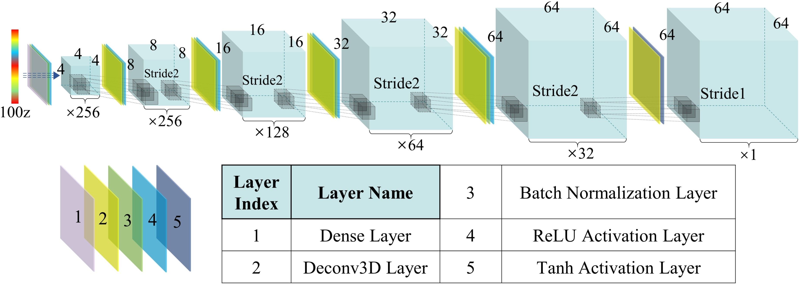
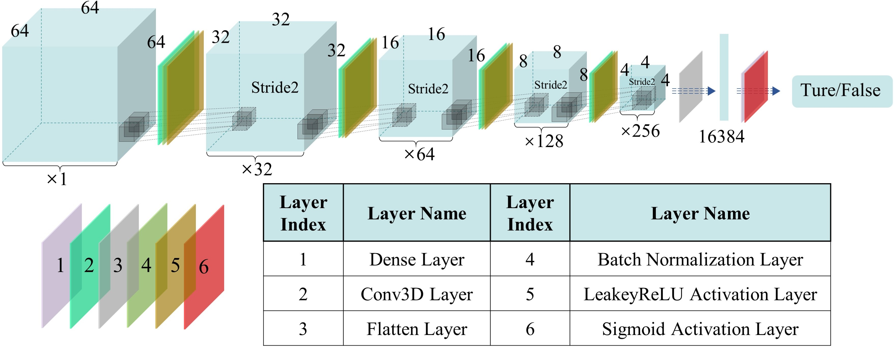
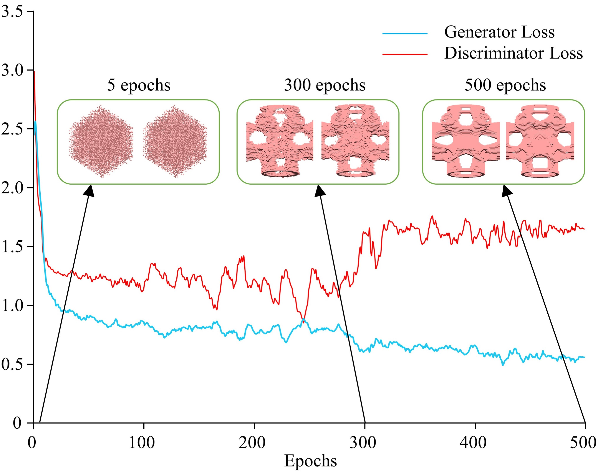

# ConnectorGEN
Structural connection components

/*

这是一个示例项目的 README 文件。

这是一个示例项目的 README 文件。

这是一个示例项目的 README 文件。

这是一个示例项目的 README 文件。
https://drive.google.com/drive/folders/1_PG9hjwNymqj46U8dVkDeaw7xVCZCKE0?usp=drive_link

https://drive.google.com/drive/folders/1_PG9hjwNymqj46U8dVkDeaw7xVCZCKE0?usp=sharing
*/
