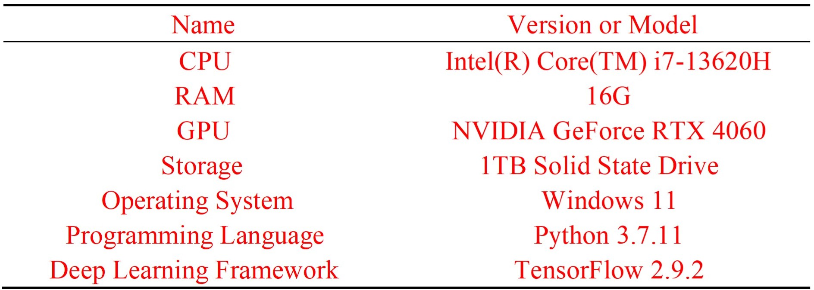
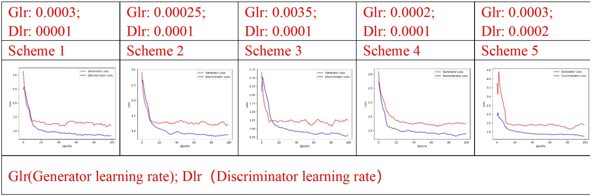

# ConnectorGEN

# Introduction:
This project implements an innovative intelligent design method for 3D structural connectors, utilizing Generative Adversarial Networks (GANs) and topology optimization techniques. Its goal is to enhance the engineering design process by providing designers with a broader range of creative ideas and generating innovative design solutions that exhibit superior mechanical properties.

# Updates:
This update primarily includes the following enhancements (May.27 2025):

Detailed hardware configuration specifications used during the model training process with this method
Addition of preliminary experiment results conducted to determine the optimal learning rate combinations for the generator and discriminator
In-depth analysis and interpretation of the aforementioned preliminary experimental results

# Prerequisites

Python: 3.7 | Anaconda: 3.x

TensorFlow: 2.9.2

CUDA: 11.2

CuDNN: 8.1

Mayavi

# Workflow

The intelligent generative design of structural connection components primarily employs techniques such as topology optimization, deep learning, and surface reconstruction and materialization. This process involves three essential steps: the establishment of deep learning datasets, the construction of deep neural networks, and the surface reconstruction and solidification of the generated 3D data.

# Network Architecture

# Data

The dataset is one of the core resources of the project, and the enhanced version of the dataset can be downloaded using the link below:https://drive.google.com/drive/folders/1_PG9hjwNymqj46U8dVkDeaw7xVCZCKE0?usp=drive_link

# Detailed Hardware Configuration Specifications:

# Pre-Experimental Program for Learning Rate
We designed several sets of pre-experiments to evaluate each of the following combinations of generator and discriminator learning rates. Comparisons were conducted to analyze the stability of the loss curves during training and the quality of the final generated samples：

Scheme 1: The generator loss tends to stabilize and is slightly higher than the discriminator loss, indicating that the quality of the generated samples is high and that the discriminator is able to provide sufficient feedback. The entire training process remains stable.
Scheme 2: There are slight fluctuations in the losses of both the generator and discriminator during the stabilization process.
Scheme 3: The initial generation is more effective; however, there are significant fluctuations in the generator's loss during the later stages. This indicates that the higher learning rate for the generator results in oscillations.
Scheme 4: There are slight fluctuations in the later stages of training, and overall stability is inadequate; the losses of the generator and discriminator are poorly balanced.
Scheme 5: The discriminator's learning rate is excessively high, causing it to optimize the decision boundary too quickly. As a result, the generator struggles to learn effectively, leading to a high generator loss.
After careful comparison, we ultimately chose the combination of Scheme 1 (Glr: 0.0003; Dlr: 0.0001), which demonstrates superior convergence, balance, and innovative quality of the generated samples across multiple training trials.

